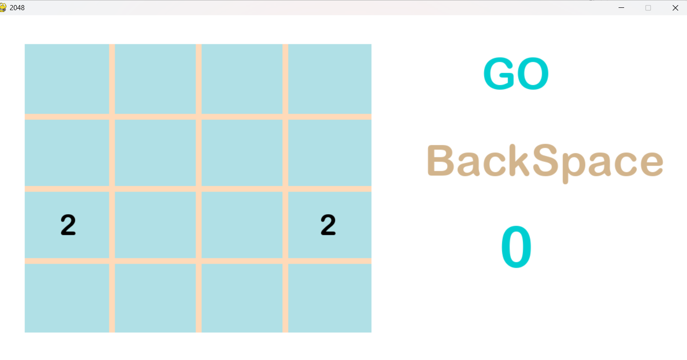
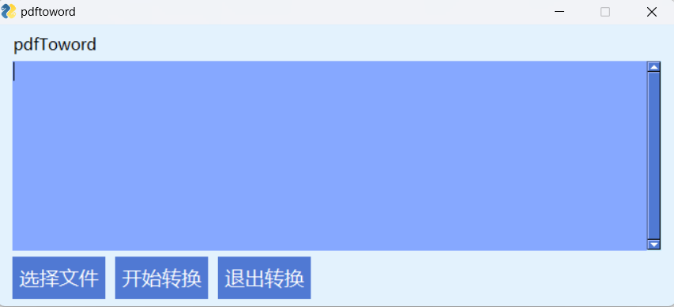

# 小游戏
---

## 项目介绍
利用Python实现了2048小游戏，pdf转为word的小程序，
根据URL生成二维码等实用工具，并且利用Pyinstaller打包(pack.py)
得到exe文件，双击即可运行。持续更新中……
---

## 部分功能展示
### 2048

方向键控制数字移动，退格键BackSpace不限次悔棋
### pdftoword

### 二维码生成小助手

以及得到的二维码


### 原理介绍
2048运用了Python的numpy和PyGame，pdftoword和生成二维码都是直接调用了相关的Python库。
话不多说，就直接把代码相应的附在一起了
### 附
pack.py利用了Pyinstaller进行进一步封装，便于打包，使用示例如下：
```
from pack import pack
from os import getcwd
p=pack(getcwd())
p.base('My_QRcode.py',name='二维码生成小助手',icon=r"sl.jpg")
```
目前仅支持简单的打包